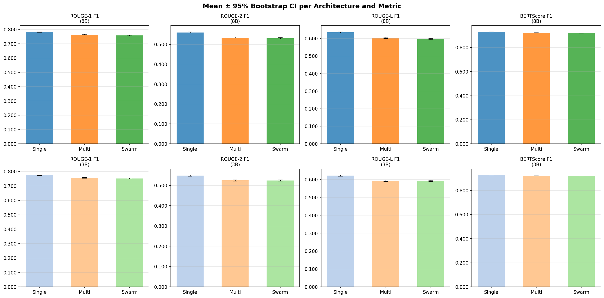
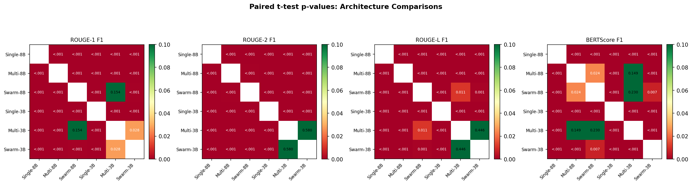
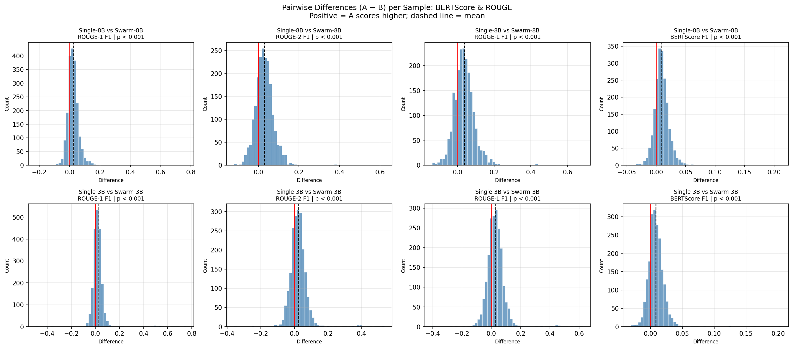

# Statistical Significance Analysis

This document discloses the full methodology and results of the inferential statistical tests
conducted on the benchmark evaluation data, addressing Reviewer 3's request for significance
testing on per-case metrics.

---

## Test Setup

### Data

- **Test set**: 2,006 held-out examples (one per unique ICD-10 code), fixed split seed, stratified.
- **Per-case metrics**: Each benchmark run stores one score per sample in the JSON result files
  (`*/benchmark_results/*.json`). Keys differ by architecture: single-agent uses `rouge` /
  `bertscore`; multi- and swarm-agent use `rouge_combined` / `bertscore_combined`.
- **Metrics evaluated**: ROUGE-1 F1, ROUGE-2 F1, ROUGE-L F1, BERTScore F1 (roberta-large).

### Why Paired Tests

All six architectures are evaluated on the **same 2,006 test cases in the same order**.
This makes paired tests appropriate: each pair of architectures shares the same input per row,
removing inter-sample variability and increasing statistical power.

### Tests Applied

| Test | When used | Assumption |
|------|-----------|------------|
| **Paired t-test** (two-tailed) | Primary test for all pairs | Differences approx. normal (satisfied by n = 2,006 via CLT) |
| **Wilcoxon signed-rank** | Non-parametric cross-check | No distributional assumption on differences |
| **95% Bootstrap CI** (10,000 resamples, seed 0) | Reported alongside each mean | No distributional assumption |
| **Cohen's d (paired)** | Effect size | d = mean(diff) / sd(diff) |

### Significance Threshold

α = 0.05, two-tailed. Stars: `***` p < 0.001 · `**` p < 0.01 · `*` p < 0.05 · `ns` p ≥ 0.05.

No multiple-comparison correction (Bonferroni / FDR) was applied; all p-values are raw.
With 2,006 paired observations, even trivially small differences can reach p < 0.05.
**Always read Cohen's d and the Wilcoxon cross-check alongside the t-test p-value.**

### Comparisons Performed

- Architecture within 8B: Single vs Multi · Single vs Swarm · Multi vs Swarm
- Architecture within 3B: same three pairs
- Scale: Single 8B vs 3B · Multi 8B vs 3B · Swarm 8B vs 3B

---

## Means and 95% Bootstrap Confidence Intervals

All values are F1 scores. Each cell is formatted as **mean [lower bound, upper bound]**, where the two numbers in brackets are the 2.5th and 97.5th percentiles of 10,000 bootstrap resamples (seed 0) — i.e. the 95% confidence interval for the mean. A narrower interval means a more precisely estimated mean; intervals here are tight because n = 2,006 is large.

### 8B Models

| Model | ROUGE-1 F1 | ROUGE-2 F1 | ROUGE-L F1 | BERTScore F1 |
|-------|-----------|-----------|-----------|--------------|
| Single-8B | 0.7818 [0.7797, 0.7837] | 0.5600 [0.5568, 0.5630] | 0.6348 [0.6315, 0.6380] | 0.9300 [0.9293, 0.9306] |
| Multi-8B  | 0.7637 [0.7616, 0.7657] | 0.5342 [0.5311, 0.5373] | 0.6036 [0.6002, 0.6070] | 0.9215 [0.9208, 0.9221] |
| Swarm-8B  | 0.7577 [0.7550, 0.7603] | 0.5301 [0.5267, 0.5333] | 0.5972 [0.5935, 0.6008] | 0.9208 [0.9200, 0.9215] |

### 3B Models

| Model | ROUGE-1 F1 | ROUGE-2 F1 | ROUGE-L F1 | BERTScore F1 |
|-------|-----------|-----------|-----------|--------------|
| Single-3B | 0.7743 [0.7721, 0.7764] | 0.5486 [0.5453, 0.5517] | 0.6222 [0.6188, 0.6256] | 0.9284 [0.9278, 0.9291] |
| Multi-3B  | 0.7557 [0.7530, 0.7582] | 0.5248 [0.5215, 0.5281] | 0.5932 [0.5896, 0.5967] | 0.9211 [0.9205, 0.9218] |
| Swarm-3B  | 0.7523 [0.7490, 0.7553] | 0.5241 [0.5206, 0.5275] | 0.5920 [0.5882, 0.5958] | 0.9199 [0.9191, 0.9206] |

---

## Figure 1 — Mean ± 95% Bootstrap CI



Each bar shows the mean F1 score; error bars are 95% percentile bootstrap confidence intervals
(10,000 resamples, seed 0). **Top row**: 8B models. **Bottom row**: 3B models.
The non-overlapping CIs between Single and the two multi-model architectures (especially for
ROUGE) visually confirm the significant differences found in the paired tests below. The
near-identical CI positions of Multi and Swarm bars foreshadow the negligible effect sizes
between those two architectures.

---

## Paired t-Test Results — Architecture Comparisons (8B)

### Single-8B vs Multi-8B

| Metric | Δ (Single − Multi) | t | p (t-test) | p (Wilcoxon) | Cohen's d | Sig. |
|--------|-------------------|---|------------|--------------|-----------|------|
| ROUGE-1   | +0.0181 | 25.006 | < 0.001 | < 0.001 | 0.558 | *** |
| ROUGE-2   | +0.0258 | 27.159 | < 0.001 | < 0.001 | 0.606 | *** |
| ROUGE-L   | +0.0312 | 27.709 | < 0.001 | < 0.001 | 0.619 | *** |
| BERTScore | +0.0085 | 35.823 | < 0.001 | < 0.001 | 0.800 | *** |

Single-8B scores significantly higher than Multi-8B on all four metrics. The BERTScore effect
size (d = 0.80) is at the boundary of medium/large; ROUGE effects are medium (d ≈ 0.56–0.62).

### Single-8B vs Swarm-8B

| Metric | Δ (Single − Swarm) | t | p (t-test) | p (Wilcoxon) | Cohen's d | Sig. |
|--------|-------------------|---|------------|--------------|-----------|------|
| ROUGE-1   | +0.0240 | 20.801 | < 0.001 | < 0.001 | 0.464 | *** |
| ROUGE-2   | +0.0299 | 26.694 | < 0.001 | < 0.001 | 0.596 | *** |
| ROUGE-L   | +0.0376 | 27.881 | < 0.001 | < 0.001 | 0.623 | *** |
| BERTScore | +0.0092 | 29.770 | < 0.001 | < 0.001 | 0.665 | *** |

Single-8B scores significantly higher than Swarm-8B on all metrics. Despite the larger absolute
ROUGE gaps, the BERTScore difference (Δ = +0.0092, d = 0.665) confirms the semantic quality
advantage is real and consistent across all 2,006 cases.

> **Paper statement**: Single-8B achieves significantly higher BERTScore F1 (0.9300) than
> Swarm-8B (0.9208; paired t-test, t = 29.77, p < 0.001, Cohen's d = 0.665).

### Multi-8B vs Swarm-8B

| Metric | Δ (Multi − Swarm) | t | p (t-test) | p (Wilcoxon) | Cohen's d | Sig. |
|--------|------------------|---|------------|--------------|-----------|------|
| ROUGE-1   | +0.0059 | 4.980 | < 0.001 | < 0.001 | 0.111 | *** |
| ROUGE-2   | +0.0041 | 3.488 | 0.0005  | 0.0019  | 0.078 | *** |
| ROUGE-L   | +0.0064 | 4.603 | < 0.001 | < 0.001 | 0.103 | *** |
| BERTScore | +0.0007 | 2.258 | 0.0241  | 0.1605  | 0.050 | *   |

ROUGE differences are statistically significant but negligible (d ≈ 0.08–0.11). For BERTScore
the paired t-test is marginally significant (p = 0.024), but the Wilcoxon test is **not**
(p = 0.161) and the effect size is negligible (d = 0.050, Δ = +0.0007).

> **Paper statement**: The BERTScore F1 difference between Multi-8B (0.9215) and Swarm-8B
> (0.9208) is not practically meaningful — effect size d = 0.050 (negligible) and the
> non-parametric Wilcoxon test is non-significant (p = 0.161), even though the paired t-test
> reaches p = 0.024 at n = 2,006.

---

## Paired t-Test Results — Architecture Comparisons (3B)

### Single-3B vs Multi-3B

| Metric | Δ (Single − Multi) | t | p (t-test) | p (Wilcoxon) | Cohen's d | Sig. |
|--------|-------------------|---|------------|--------------|-----------|------|
| ROUGE-1   | +0.0186 | 15.688 | < 0.001 | < 0.001 | 0.350 | *** |
| ROUGE-2   | +0.0237 | 20.568 | < 0.001 | < 0.001 | 0.459 | *** |
| ROUGE-L   | +0.0290 | 21.491 | < 0.001 | < 0.001 | 0.480 | *** |
| BERTScore | +0.0073 | 31.458 | < 0.001 | < 0.001 | 0.702 | *** |

Replicates the 8B pattern: Single-3B significantly outperforms Multi-3B, with medium effect
sizes throughout.

### Single-3B vs Swarm-3B

| Metric | Δ (Single − Swarm) | t | p (t-test) | p (Wilcoxon) | Cohen's d | Sig. |
|--------|-------------------|---|------------|--------------|-----------|------|
| ROUGE-1   | +0.0220 | 14.636 | < 0.001 | < 0.001 | 0.327 | *** |
| ROUGE-2   | +0.0244 | 18.881 | < 0.001 | < 0.001 | 0.422 | *** |
| ROUGE-L   | +0.0302 | 20.000 | < 0.001 | < 0.001 | 0.447 | *** |
| BERTScore | +0.0086 | 29.330 | < 0.001 | < 0.001 | 0.655 | *** |

### Multi-3B vs Swarm-3B

| Metric | Δ (Multi − Swarm) | t | p (t-test) | p (Wilcoxon) | Cohen's d | Sig. |
|--------|------------------|---|------------|--------------|-----------|------|
| ROUGE-1   | +0.0034 | 2.203 | 0.0277 | 0.3866 | 0.049 | *  |
| ROUGE-2   | +0.0007 | 0.553 | 0.5804 | 0.3013 | 0.012 | ns |
| ROUGE-L   | +0.0012 | 0.763 | 0.4457 | 0.5184 | 0.017 | ns |
| BERTScore | +0.0013 | 4.620 | < 0.001 | < 0.001 | 0.103 | *** |

Multi-3B vs Swarm-3B mirrors the 8B finding: ROUGE-2 and ROUGE-L are non-significant; the
ROUGE-1 t-test result (p = 0.028) is not confirmed by Wilcoxon (p = 0.387); BERTScore is
technically significant but d = 0.103 (negligible). The two architectures are functionally
equivalent at 3B scale.

---

## Paired t-Test Results — Scale Comparisons (8B vs 3B)

### Single-8B vs Single-3B

| Metric | Δ (8B − 3B) | t | p (t-test) | p (Wilcoxon) | Cohen's d | Sig. |
|--------|------------|---|------------|--------------|-----------|------|
| ROUGE-1   | +0.0075 |  9.632 | < 0.001 | < 0.001 | 0.215 | *** |
| ROUGE-2   | +0.0114 | 12.688 | < 0.001 | < 0.001 | 0.283 | *** |
| ROUGE-L   | +0.0126 | 11.409 | < 0.001 | < 0.001 | 0.255 | *** |
| BERTScore | +0.0015 |  6.649 | < 0.001 | < 0.001 | 0.148 | *** |

8B outperforms 3B for the single-agent setting; BERTScore effect is small (d = 0.148).

### Multi-8B vs Multi-3B

| Metric | Δ (8B − 3B) | t | p (t-test) | p (Wilcoxon) | Cohen's d | Sig. |
|--------|------------|---|------------|--------------|-----------|------|
| ROUGE-1   | +0.0080 | 7.280 | < 0.001 | < 0.001 | 0.163 | *** |
| ROUGE-2   | +0.0093 | 8.328 | < 0.001 | < 0.001 | 0.186 | *** |
| ROUGE-L   | +0.0104 | 7.903 | < 0.001 | < 0.001 | 0.176 | *** |
| BERTScore | +0.0004 | 1.443 | 0.1493  | 0.2309  | 0.032 | ns  |

BERTScore difference between Multi-8B and Multi-3B is **not significant** (p = 0.149,
Wilcoxon p = 0.231, d = 0.032).

> **Paper statement**: The BERTScore F1 difference between Multi-8B (0.9215) and Multi-3B
> (0.9211) is not statistically significant (paired t-test, p = 0.149).

### Swarm-8B vs Swarm-3B

| Metric | Δ (8B − 3B) | t | p (t-test) | p (Wilcoxon) | Cohen's d | Sig. |
|--------|------------|---|------------|--------------|-----------|------|
| ROUGE-1   | +0.0054 | 3.392 | 0.0007  | 0.0001  | 0.076 | *** |
| ROUGE-2   | +0.0060 | 4.377 | < 0.001 | < 0.001 | 0.098 | *** |
| ROUGE-L   | +0.0051 | 3.252 | 0.0012  | 0.0039  | 0.073 | *** |
| BERTScore | +0.0009 | 2.689 | 0.0072  | < 0.001 | 0.060 | **  |

All effects are negligible (d ≤ 0.098).

---

## Figure 2 — p-value Heatmap



Each cell shows the raw p-value of the paired t-test between the row model and the column model.
Colour scale runs from green (p ≈ 0, strong evidence of difference) to red (p ≈ 0.1, weak or
no evidence). The diagonal is undefined (self-comparison).

Key observations at a glance: the **BERTScore panel** (rightmost) shows a clear green block
for Single vs {Multi, Swarm} and near-red/yellow cells for Multi vs Swarm — confirming that
the single-agent advantage is robust while the multi-vs-swarm difference is marginal. The
scale comparisons (8B vs 3B within the same architecture) are mostly yellow-green for ROUGE
but yellow-red for BERTScore, reflecting the small BERTScore size effects.

---

## Figure 3 — Per-Sample Difference Distributions



Each histogram shows the **per-sample difference** (A − B) across all 2,006 test cases.
The red vertical line marks zero (no difference); the dashed black line marks the sample mean.

- **Top row**: Single-8B minus Swarm-8B. Distributions are centred clearly to the right of
  zero for all four metrics, confirming Single-8B's consistent advantage. The BERTScore
  distribution (rightmost) is narrow but the mass sits to the right of zero throughout.
- **Bottom row**: Single-3B minus Swarm-3B. Mirrors the 8B pattern, with slightly wider
  spreads reflecting the lower 3B performance floor.

The width of these distributions also illustrates why effect sizes (Cohen's d) are small even
when means differ significantly: there is substantial per-case overlap, meaning neither
architecture uniformly dominates on every individual sample.

---

## Summary Table

Δ = Mean(A) − Mean(B). Stars indicate paired t-test significance.

| Comparison | ROUGE-1 Δ | ROUGE-2 Δ | ROUGE-L Δ | BERTScore Δ |
|------------|----------|----------|----------|------------|
| Single-8B vs Multi-8B  | +0.0181 *** | +0.0258 *** | +0.0312 *** | +0.0085 *** |
| Single-8B vs Swarm-8B  | +0.0240 *** | +0.0299 *** | +0.0376 *** | +0.0092 *** |
| Multi-8B  vs Swarm-8B  | +0.0059 *** | +0.0041 *** | +0.0064 *** | +0.0007 *   |
| Single-3B vs Multi-3B  | +0.0186 *** | +0.0237 *** | +0.0290 *** | +0.0073 *** |
| Single-3B vs Swarm-3B  | +0.0220 *** | +0.0244 *** | +0.0302 *** | +0.0086 *** |
| Multi-3B  vs Swarm-3B  | +0.0034 *   | +0.0007 ns  | +0.0012 ns  | +0.0013 *** |
| Single-8B vs Single-3B | +0.0075 *** | +0.0114 *** | +0.0126 *** | +0.0015 *** |
| Multi-8B  vs Multi-3B  | +0.0080 *** | +0.0093 *** | +0.0104 *** | +0.0004 ns  |
| Swarm-8B  vs Swarm-3B  | +0.0054 *** | +0.0060 *** | +0.0051 *** | +0.0009 **  |

`***` p < 0.001 · `**` p < 0.01 · `*` p < 0.05 · `ns` p ≥ 0.05

---

## Swarm-Agent Training Data: Cross-Pairing and Its Implications

Understanding how the Swarm-Agent's Critic and Refiner were trained is necessary for correctly
interpreting its benchmark results. This section documents the cross-pairing procedure and its
known limitations.

### Background

The DCR pipeline requires training data that contains *imperfect drafts* paired with
*programmatic critiques* and *refined reference outputs*. No such data exists naturally in the
MedSynth dataset, so it is generated synthetically via ICD-10 code cross-pairing
(implemented in `data_preperation.ipynb`, function `build_cross_pairs`).

### Cross-Pairing Algorithm

1. **Group by ICD-10 code.** All training rows are grouped by their diagnosis code.
2. **Circular shift pairing (groups ≥ 2 members).** Each row is paired with the next row in
   its group (wrapping around), producing exactly N pairs for a group of size N. The paired
   row's SOAP note serves as the "imperfect draft" — it covers the same diagnosis but was
   written for a different patient, introducing realistic variation without being completely
   off-topic.
3. **Singleton fallback (groups with 1 member).** ICD codes that appear only once in a split
   cannot be paired within-code. All such singletons are collected, shuffled, and paired
   sequentially across ICD codes. Each pair produces 2 training entries (both directions).
   If the number of singletons is odd, the last singleton is dropped.

### Singleton Counts per Split

With the fixed random seed (SEED = 0), all splits yield an even singleton count, so no samples
are lost:

| Split      | Singletons | Cross-pair entries | Dropped |
|------------|------------|-------------------|---------|
| Training   | 10         | 10                | 0       |
| Validation | 592        | 592               | 0       |
| Test       | 2,006      | 2,006             | 0       |

The high singleton counts in validation and test are structurally expected: the 70/10/20
stratified split assigns approximately 0.4 samples per ICD code to validation and exactly
1 sample per code to the test set, so nearly every ICD code is a singleton in those splits.

### Seed Sensitivity

The zero-drop outcome is seed-dependent. With a different seed, an odd singleton count would
cause exactly 1 sample to be dropped per affected split — a maximum loss of 1 sample
(< 0.05% of any split). Any such loss would affect Critic and Refiner roles uniformly across
all four SOAP dimensions, keeping the dataset balanced.

### Implication for Benchmark Interpretation

The singleton fallback introduces a meaningful limitation: when singletons are paired across
ICD codes, the "imperfect draft" comes from a different diagnosis. The resulting synthetic
critique is less clinically precise — it may flag differences that are appropriate for the
source diagnosis but not errors in context. These cross-ICD pairs still teach the model the
critique format and task structure, but the training signal for *clinical accuracy* of the
critique is weaker than for within-code pairs.

This is directly relevant to the statistical results:

- The Swarm-Agent shows **no significant BERTScore improvement over Multi-Agent** (Δ = +0.0007,
  d = 0.050, Wilcoxon p = 0.161 at 8B; Δ = +0.0013, d = 0.103 at 3B).
- The Drafter-only ablation shows the DCR loop provides mixed ROUGE gains (positive for
  Objective, Assessment, Plan; negative for Subjective at both scales), suggesting the
  Critic–Refiner stage sometimes overwrites correct content rather than improving it.
- The validation and test splits consist almost entirely of cross-ICD singleton pairs. This
  means the Critic and Refiner were evaluated under the same cross-ICD pairing conditions
  they were primarily trained on — making it harder to isolate whether the DCR loop fails
  due to the cross-ICD training signal or due to a fundamental architectural limitation.

In sum, the swarm result should be interpreted as a **negative result under realistic synthetic
data constraints**, not as evidence that DCR pipelines cannot work in principle. A cleaner
critic/refiner training corpus (e.g. from human-annotated draft–critique–refinement triplets)
could yield a different outcome.

---

## Key Findings for the Paper

1. **Single-agent consistently wins.** Both Single-8B and Single-3B significantly outperform
   their Multi- and Swarm-Agent counterparts on every metric (all p < 0.001). BERTScore effect
   sizes are medium (d ≈ 0.65–0.80 for 8B; d ≈ 0.65–0.70 for 3B) — not a statistical artefact.

2. **Multi vs Swarm is practically negligible.** The BERTScore gap between Multi-8B and
   Swarm-8B is Δ = +0.0007 (d = 0.050), with Wilcoxon p = 0.161 (non-significant). At 3B,
   Wilcoxon confirms non-significance for ROUGE-2 and ROUGE-L. The DCR pipeline adds
   12× the adapter complexity without a measurable quality benefit.

3. **Model scale matters little for BERTScore in multi- and swarm-agent settings.**
   Multi-8B vs Multi-3B BERTScore: p = 0.149 (ns), d = 0.032.
   Swarm-8B vs Swarm-3B BERTScore: d = 0.060 (negligible).
   The architectural bottleneck dominates over the capacity bottleneck.

4. **Statistical significance ≠ practical significance at n = 2,006.** With 2,006 paired
   observations, Δ = 0.0007 reaches p = 0.024. Always read Cohen's d and the Wilcoxon
   cross-check alongside the t-test p-value.

---

## Reproducibility

```bash
# Execute the full analysis notebook
jupyter nbconvert --to notebook --execute statistical_analysis.ipynb
```

Outputs: `statistical_analysis_ci.png`, `statistical_analysis_pvalues.png`,
`statistical_analysis_diffs.png`.

Random seed: **0** (bootstrap resampling only; t-test and Wilcoxon are deterministic).  
Software: Python 3.x · NumPy · SciPy · pandas · matplotlib.
